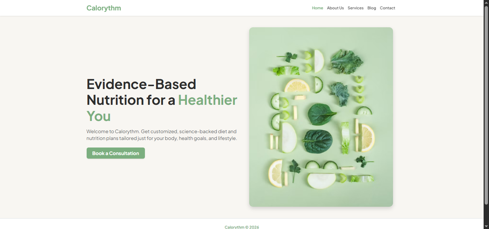
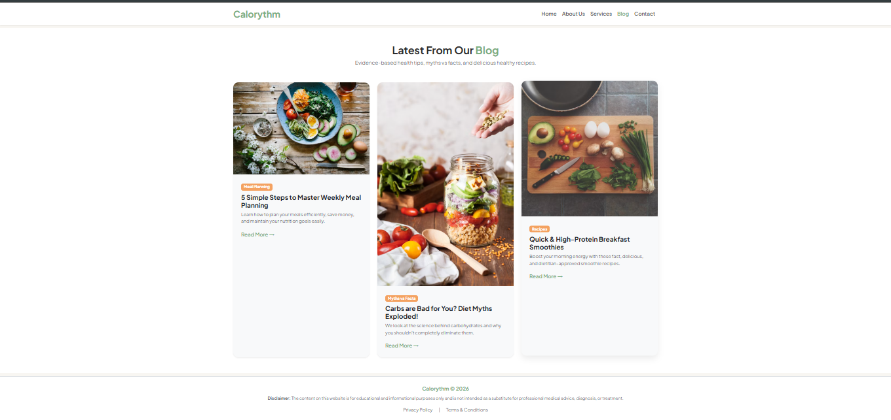
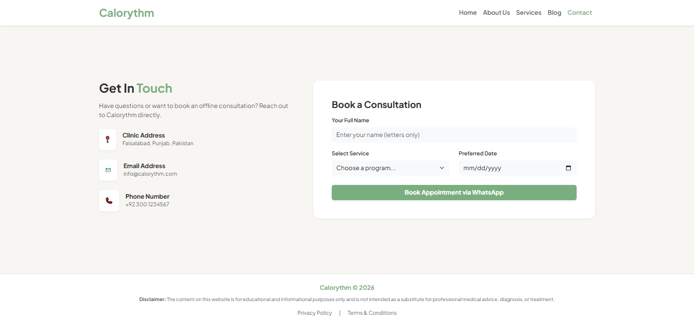

# 🍎 Calorythm | Health & Fitness Website

Calorythm is a modern and responsive health and fitness website designed to help users explore healthy lifestyle and calorie-related information through a clean and user-friendly interface.

## ✨ Features

- 🥗 Clean and modern health-focused design
- 📱 Responsive layout for mobile and desktop
- 🧭 Easy navigation
- 💻 User-friendly interface
- 🎨 Attractive and organized sections

## 🛠️ Technologies Used

- HTML5
- CSS3
- Bootstrap
- JavaScript

## 🌐 Live Demo

[Visit Calorythm Website](https://amnamsaeed5-hash.github.io/calorythm-/)

## 🎯 Project Purpose

The purpose of Calorythm is to provide a simple and attractive web interface related to health, fitness and calorie awareness.

## 👩‍💻 Developed By

**Amna Saeed**
## 📸 Screenshots

### 🏠 Home Page

### 📖 About Us

### 📝 Blog

### 📞 Contact

